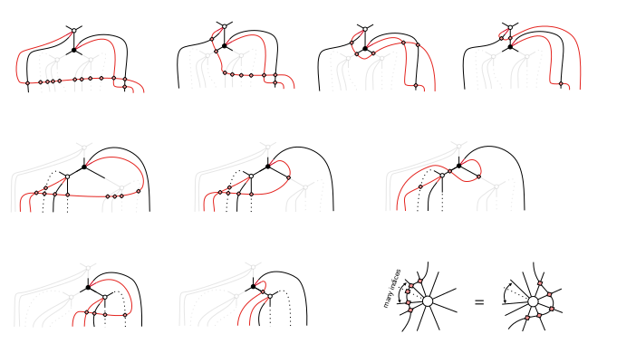

# Thermodynamics of the Hubbard Model on the Bethe Lattice

This code is an implementation of the paper *Thermodynamics of the Hubbard Model on the Bethe Lattice*. It provides a framework for evaluating finite-temperature properties of a nearest-neighbor interaction Hamiltonian defined on a Bethe lattice, supporting arbitrary coordination numbers $z$.

The code prepares the density matrix $\rho(\beta)$ at inverse temperature $\beta$ (aka Thermofield Double State, TFD) using the simple update (+ canonicalization). For fermions, swap gates are used to account for the anti-commutation relations.

### TODO
- [ ] add examples
- [ ] add explanation about simplification of swap gates
- [ ] code cleanup

## Usage
### Requirements
```bash
# Remember to create a virtual environment
pip install -r requirements.txt
```

### Model defination
The model is defined in the folder `phy_model`. The local Hamiltonian and the parity of the basis need to be defined. We provide Hamiltonian definitions for the Heisenberg model as an example of the Bosonic case and the Hubbard model as an example of the Fermionic case.

### Imaginary time evolution
```bash
python main_thermal.py -prefix test -U 4 -tau 0.05 -Ntau 100 -chi 100 -cuda 0
```
Command above prepare the density operator $\rho(\beta)$ for the Hubbard model at half-filling for $U=4$ ( from $\beta = 0$ $\rightarrow$ $\beta = N \tau$ ). The tau ($\tau$) parameter corresponds to the step size in the Suzuki-Trotter decomposition, controlling the system's decomposition error. The chi parameter is the upperbound for the bond dimension of the TTN ansatz, controlling the truncation error. The density operator $\rho(\beta)$ will be saved in the `ckp_test` folder.

### Measurement
```bash
python main_obs.py -prefix test -U 4 -tau 0.05 -Ntau 100 -chi 100
```
Command above reads the checkpoint of the density operator $\rho(\beta)$ from ckp_test and calculates the corresponding physical quantities.

## Technical Notes

### Simplification of Swap Gates



